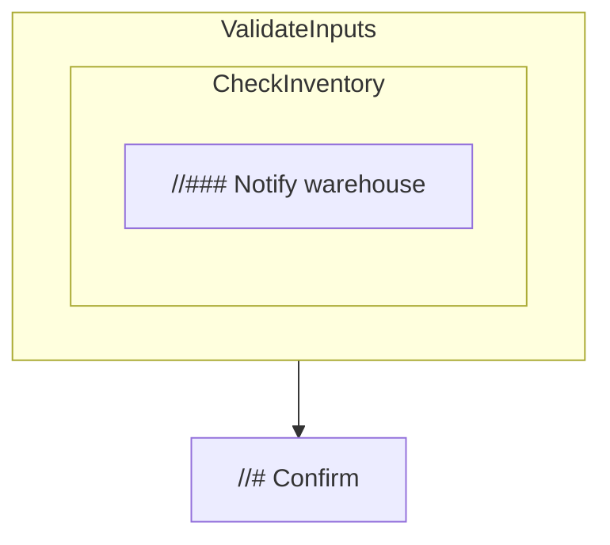

# HIR Header Preservation Specification

## Functional Goal
We must retain header hierarchy in HIR so control-flow visualization can render nested comment structure instead of a flat list. Without level and parent information, the graph loses context, making timelines and trace playback impossible to align with author intent.

Example input:

```baml
function ProcessOrder() {
  //# Validate Inputs
  validate()

  //## Check inventory
  if (needs_stock()) {
    //### Notify warehouse
    notify()
  }

  //# Confirm
  confirm()
}
```

Desired visualization:



This document describes what changes we need to implement to meet the above described functional goal. It summarizes the current AST→HIR lowering behavior and defines the required HIR data shape so hierarchical headers (`//#`, `//##`, `//###`, …) can survive into downstream control-flow visualization.

## 1. Current AST→HIR Lowering

Key lowering logic lives in `engine/baml-compiler/src/hir/lowering.rs` with supporting HIR definitions in `engine/baml-compiler/src/hir.rs`. The most relevant transforms today are:

- **Top-level assembly** — `Hir::from_ast` iterates `ast::Top` items, converts functions/classes/enums into HIR structs, adds builtin classes/enums up front, and post-processes parameter/return types so any type that resolves to a known enum uses `TypeIR::Enum` instead of `TypeIR::Class`.
- **Block preparation** — `Block::from_expr_block` does a two-pass walk over `ast::ExpressionBlock`: first it records `WatchOptions` statements so subsequent `watch` declarations can capture channel/when metadata; afterwards it lowers each statement and converts a trailing expression into `Block::trailing_expr`. If the trailing expression carried headers, it emits a synthetic `Statement::AnnotatedStatement { headers, statement: None }`.
- **Statement lowering** — `lower_stmt_with_options` handles every `ast::Stmt` variant. Important desugarings include:
  - C-style `for` loops: inject an initializer into an `Expression::Block` when present, map `for (init; cond; after)` without `after` to a plain `Statement::While`, and otherwise lower to the dedicated `Statement::CForLoop`.
  - Watchful variables: `watch let` statements gain an initial `WatchSpec`, later patched by `Statement::WatchOptions`.
  - All headers captured in the AST are wrapped by `maybe_annotated_statement`, which currently turns them into `Statement::AnnotatedStatement { headers: Vec<String>, statement: Option<Box<Statement>> }` and thereby loses level/span metadata.
- **Expression adjustments** — `Expression::from_ast` preserves structure for most constructs but applies a few targeted rewrites:
  - `env.foo` becomes a call to `env.get("foo")`.
  - Bare function applications (`Name(args)`) become `Expression::Call` with concrete `TypeArg`s.
  - Expression blocks recurse through `Block::from_expr_block`, so watchers and headers flow through nested scopes.
- **Class/enum lowering** — `Class::from_ast` and `Enum::from_ast` capture field/variant data. Unsupplied field types default to `string`.

### Header Limitations Today

- `Statement::AnnotatedStatement` only stores `Vec<String>` with the header titles. The header level (`#` count), source `Span`, and ordering metadata are discarded.
- When multiple headers precede the same statement, their relative nesting cannot be reconstructed from `Vec<String>`.
- Downstream representations (THIR, codegen, control-flow viz) mirror this string-only structure, so no later stage can rebuild hierarchical relationships.

## 2. Desired HIR Header Representation

To support hierarchical control-flow labeling, the HIR must retain enough structure for each header comment to know:
- which lexical scope it belongs to,
- its level (`//#` → 1, `//##` → 2, …),
- source span for diagnostics,
- and textual title for UI display / slug generation.

### Proposed Data Model Changes

1. **Add a header frame statement** to `hir::Statement`:

   ```rust
   pub enum Statement {
       // …existing variants…
       HeaderContextStart(HeaderContext),
   }

   #[derive(Clone, Debug)]
   pub struct HeaderContext {
       pub level: u8,
       pub title: String,
       pub span: Span,
   }
   ```

   - `HeaderContextStart` marks the beginning of a header scope. It persists in the HIR stream as its own statement so later phases can manage header stacks explicitly.
   - `level` counts the leading `#` characters in the original comment.
   - `title` is the trimmed header text (unchanged from today’s strings).
   - `span` identifies the exact source range for diagnostics and UI highlights.

2. **Retire `Statement::AnnotatedStatement`** entirely. All header comments become one (or multiple) `HeaderContextStart` statements followed by the real statement they annotate. Trailing-expression headers are emitted as header statements immediately before a synthetic `Statement::Expression` or before the implicit return boundary if no expression follows.

3. **Lowering updates**:
   - `Block::from_expr_block` must expand each `ast::Header` into a `Statement::HeaderContextStart` carrying level/title/span before lowering the subsequent statement.
   - `maybe_annotated_statement` will be replaced with logic that prepends the appropriate number of `HeaderContextStart` statements into the statement list.
   - Any debug printing tied to annotated statements can be removed.

4. **Downstream consumers**:
   - Update THIR (`engine/baml-compiler/src/thir.rs`, `thir/typecheck.rs`) so its statement enum gains the same `HeaderContextStart` variant and carries the header metadata through to later stages.
   - Adjust control-flow visualization and other passes to interpret `HeaderContextStart` statements: they should push a header frame onto the active stack until a shallower/equal level appears or the surrounding lexical scope ends.
   - Ensure serialization, pretty printers, and diagnostics understand that header frames are first-class statements with runtime significance (e.g., they may produce trace nodes).

### Invariants to Maintain

- Header annotations always precede the wrapped statement in source order.
- Within a block, headers remain siblings unless the statement body introduces nested scopes; hierarchical meaning is derived by comparing `level` values during later passes.
- Spans must point to the exact comment range so diagnostics and visualization can highlight the right line.
- Lowering must emit header statements exactly where comments appear—no bundling or reordering across lexical scopes.

## 3. Implementation Outline for the Follow-up Agent

1. **Data model refactor**
   - Introduce `HeaderContext` and the `Statement::HeaderContextStart` variant in HIR and all downstream IRs.
   - Delete `Statement::AnnotatedStatement` and any helper structures that relied on it.
2. **Lowering changes**
   - Emit header statements directly when lowering AST headers (statements and trailing expressions).
   - Remove `maybe_annotated_statement` usage in favor of appending header statements to the surrounding block.
3. **Downstream consumers**
   - Update control-flow visualization to treat header statements as structural nodes that modify the active header stack.
   - Ensure serialization, pretty-printers, and snapshot tests reflect the new statement variant (expect snapshot churn).
4. **Testing**
   - Extend or add `.baml` fixtures that exercise mixed header levels inside nested scopes.
   - Regenerate control-flow snapshots (`cargo test -p baml-runtime control_flow::tests` with `INSTA_FORCE_PASS=1`) once control-flow updates land.
   - Run compiler unit tests to confirm HIR↔THIR transitions continue to work.

By implementing the above, the HIR will carry the structure required for the control-flow builder to maintain header hierarchies, enabling the fixes requested in `goals3.md`.
