status: DONE

The BAML compiler should be able to, for a given expression function containing `//#` `//##` `//###` HeaderContextEnter statements, build a `ControlFlowVisualization` for that function with the following structure.

For testing purposes, in engine/baml-runtime/src/control_flow/tests.rs, we'll also generate a mermaid version of the resulting ControlFlowVisualization.
```rust
#[derive(Clone, Debug, PartialEq, Eq, Hash)]
pub struct NodeId {
    function: String,
    segments: Vec<PathSegment>,
}

#[derive(Clone, Debug)]
pub struct Node {
    pub id: NodeId,
    pub parent_node_id: Option<NodeId>,
    pub label: String,
    pub span: Span,
    pub node_type: NodeType,
}

#[derive(Clone, Debug)]
pub enum NodeType {
    FunctionRoot,
    HeaderContextEnter,
    BranchGroup,
    BranchArm,
    Loop,
    OtherScope,
}

#[derive(Clone, Debug)]
pub struct Edge {
    pub src: NodeId,
    pub dst: NodeId,
}

#[derive(Clone, Debug, Default)]
pub struct ControlFlowVisualization {
    pub nodes: HashMap<NodeId, Node>,
    pub edges_by_src: HashMap<NodeId, Vec<Edge>>,
}
```

# Examples
Here are examples of how this logic works:

## Example 1
This BAML code
```baml pseudocode
function Foo() -> Void {
  //# Do lorem things
  Lorem();
  
  if (true) {
    //# set up asdf
    asdf();
  }
  
  //# Prepare ipsum recipes
  Ipsum();
}
```

will result in this ControlFlowVisualization:
```control flow pseudocode
Nodes:
  - n0: parent=None, kind=FunctionRoot("Foo")
    - n1: parent=n0, kind=HeaderContextEnter("Do lorem things")
      - n2: parent=n1, kind=BranchGroup("if (true)")
        - n3: parent=n2, kind=BranchArm("if (true)")
          - n4: parent=n3, kind=HeaderContextEnter("set up asdf")
    - n5: parent=n0, kind=HeaderContextEnter("Prepare ipsum recipes")

edges_by_src:
  n1: [n5]
```

and this mermaid:
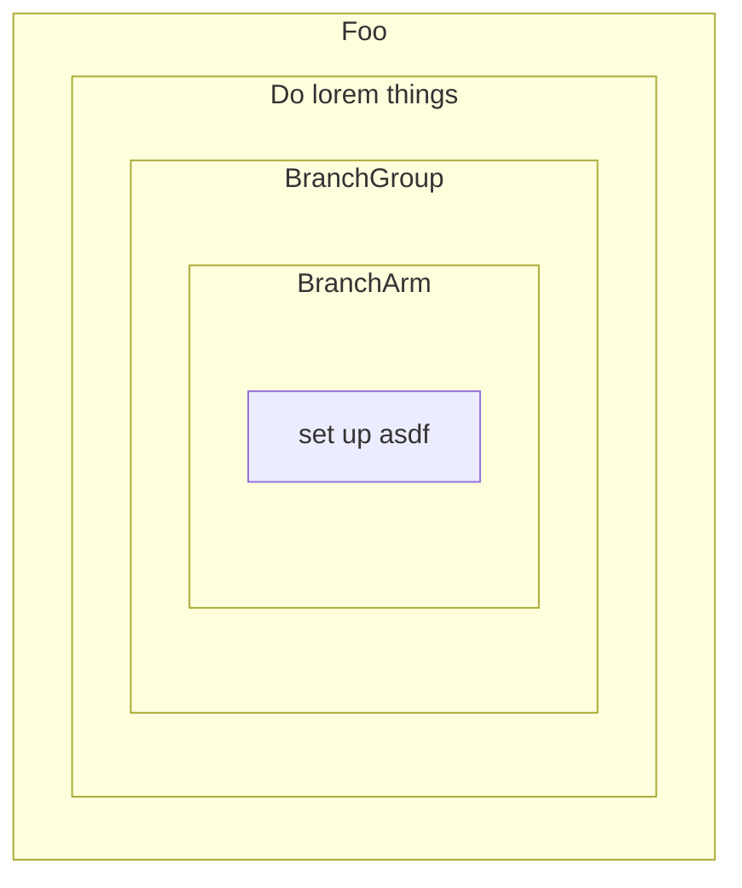
## Example 2
Demonstrates sequential top-level headers with no BranchGrouping.
```baml
function Setup() -> null {
  //# Boot sequence
  boot();
  //# Calibration
  calibrate();
}
```

will result in this ControlFlowVisualization:
```
Nodes:
  - n0: parent=None, kind=FunctionRoot("Setup")
    - n1: parent=n0, kind=HeaderContextEnter("Boot sequence")
    - n2: parent=n0, kind=HeaderContextEnter("Calibration")

edges_by_src:
  n1: [n2]
```

and this mermaid:
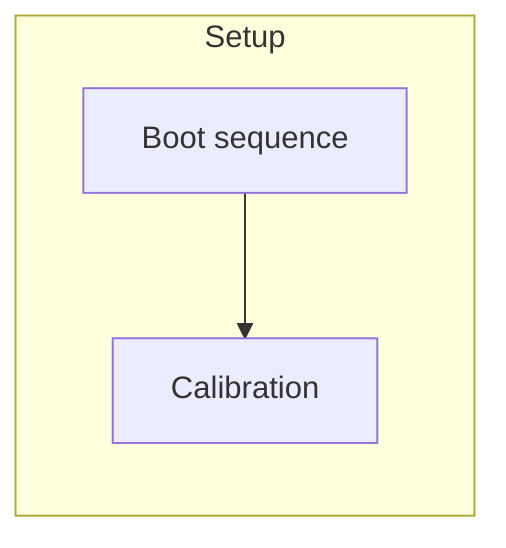
## Example 3
Shows an `if/else` where each BranchGroup acquires its own header context.
```baml pseudocode
function Choose() -> String {
  //# Build primary option
  buildPrimary();

  if (isReady) {
    //# Use primary
    finalizePrimary();
  } else {
    //# Use fallback 
    fallback();
  }

  //# Wrap up choice
  wrap();
  return outcome;
}
```

will result in this ControlFlowVisualization:
```control flow pseudocode
Nodes:
  - n0: parent=None, kind=FunctionRoot("Choose")
    - n1: parent=n0, kind=HeaderContextEnter("Build primary option")
      - n2: parent=n1, kind=BranchGroup("if (isReady)")
        - n3: parent=n2, kind=BranchArm("if (isReady)")
          - n4: parent=n3, kind=HeaderContextEnter("Use primary")
        - n5: parent=n2, kind=BranchArm("else")
          - n6: parent=n5, kind=HeaderContextEnter("Use fallback")
    - n7: parent=n0, kind=HeaderContextEnter("Wrap up choice")

edges_by_src:
  n1: [n7]
```

and this mermaid:
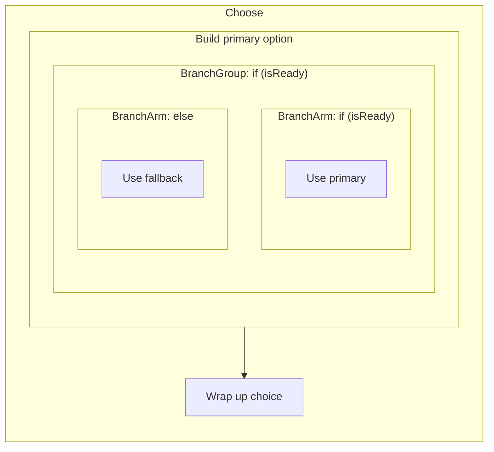

Branch edges are deliberately not represented. That is encoded in the diagram by virtue of the BranchGroup-BranchArm parent-child relationship.
## Example 4
Illustrates a loop where iterations return to the loop node until exit.
```baml pseudocode
function CompileReport() -> Void {
  //# Prepare report
  loadTemplate();

  for (item in items) {
    //# Process item
    process(item);
  }

  //# Finalize report
  finalize();
}
```

will result in this ControlFlowVisualization:
```control flow pseudocode
Nodes:
  - n0: parent=None, kind=FunctionRoot("CompileReport")
    - n1: parent=n0, kind=HeaderContextEnter("Prepare report")
      - n2: parent=n1, kind=Loop("for (item in items)")
        - n3: parent=n2, kind=HeaderContextEnter("Process item")
    - n4: parent=n0, kind=HeaderContextEnter("Finalize report")

edges_by_src:
  n1: [n4]
```

and this mermaid:
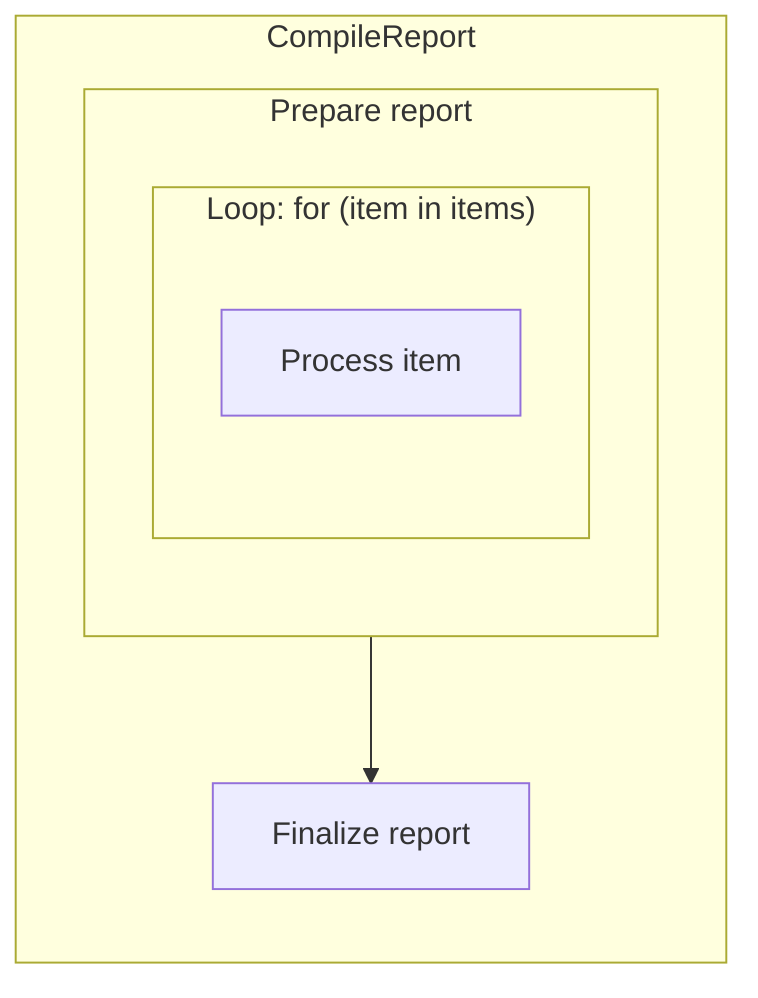

Loop edges are deliberately not represented. That is encoded in the diagram by the nature of the Loop parent node, which implies that its children repeat.
## Example 5
Captures nested headers created with `//#`, `//##`, and `//###`.
```baml pseudocode
function PlanRelease() -> Void {
  //# Outline release
  outline();
  //## Phase 1
  phaseOne();
  //### Phase 1 research
  research();
  //## Phase 2
  phaseTwo();
  //# Wrap up
  wrap();
}
```

will result in this ControlFlowVisualization:
```control flow pseudocode
Nodes:
  - n0: parent=None, kind=FunctionRoot("PlanRelease")
    - n1: parent=n0, kind=HeaderContextEnter("Outline release")
      - n2: parent=n1, kind=HeaderContextEnter("Phase 1")
        - n3: parent=n2, kind=HeaderContextEnter("Phase 1 research")
      - n4: parent=n1, kind=HeaderContextEnter("Phase 2")
    - n5: parent=n0, kind=HeaderContextEnter("Wrap up")

edges_by_src:
  n1: [n5]
  n2: [n4]
```

and this mermaid:
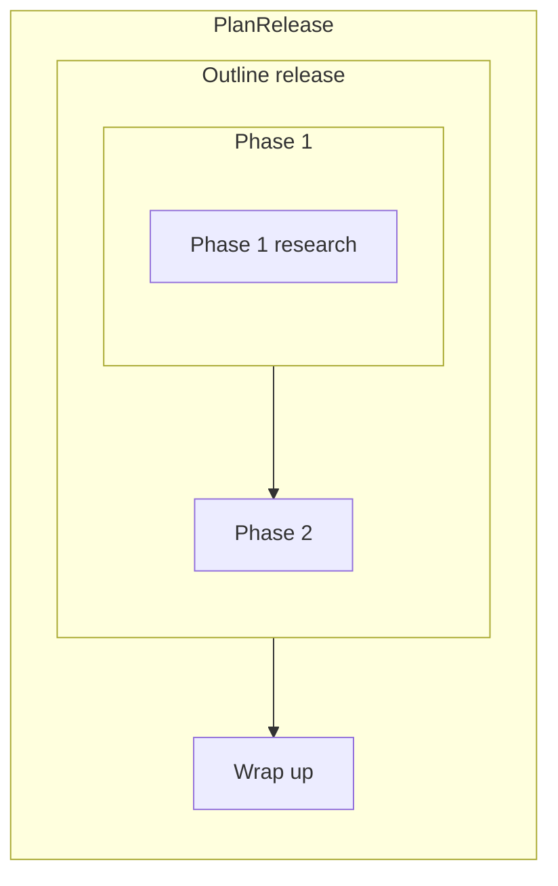

## Example 7
Highlights `OtherScope` nodes created by braces that introduce a scope under a header.
```baml pseudocode
function BuildPipeline() -> Void {
  //# Setup context
  {
    initialize();
    //# In-scope configuration
    configure();
  }
  //# Done
  finish();
}
```

will result in this ControlFlowVisualization:
```control flow pseudocode
Nodes:
  - n0: parent=None, kind=FunctionRoot("BuildPipeline")
    - n1: parent=n0, kind=HeaderContextEnter("Setup context")
      - n2: parent=n1, kind=OtherScope
        - n3: parent=n2, kind=HeaderContextEnter("In-scope configuration")
    - n4: parent=n0, kind=OtherScope
      - n5: parent=n4, kind=HeaderContextEnter("Boostrap schemas")
    - n6: parent=n0, kind=HeaderContextEnter("Done")

edges_by_src:
  n1: [n6]
```

and this mermaid:
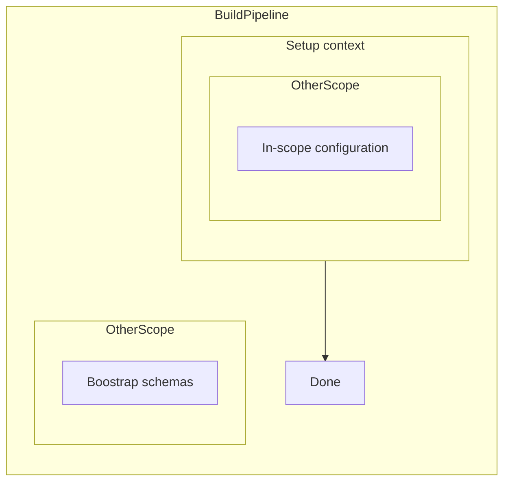

## Example 9
Shows an expression block captured as an `OtherScope` node with nested headers.
```baml pseudocode
function BuildConfig() -> Config {
  //# Compose config
  let config = {
    //# Populate defaults
    defaults();
    //# Apply overrides
    overrides();
  };
  //# Finish config
  return finalize(config);
}
```

will result in this ControlFlowVisualization:
```control flow pseudocode
Nodes:
  - n0: parent=None, kind=FunctionRoot("BuildConfig")
    - n1: parent=n0, kind=HeaderContextEnter("Compose config")
      - n2: parent=n1, kind=OtherScope // "let config = { ... }"
        - n3: parent=n2, kind=HeaderContextEnter("Populate defaults")
        - n4: parent=n2, kind=HeaderContextEnter("Apply overrides")
    - n5: parent=n0, kind=HeaderContextEnter("Finish config")

edges_by_src:
  n1: [n5]
  n3: [n4]
```

and this mermaid:
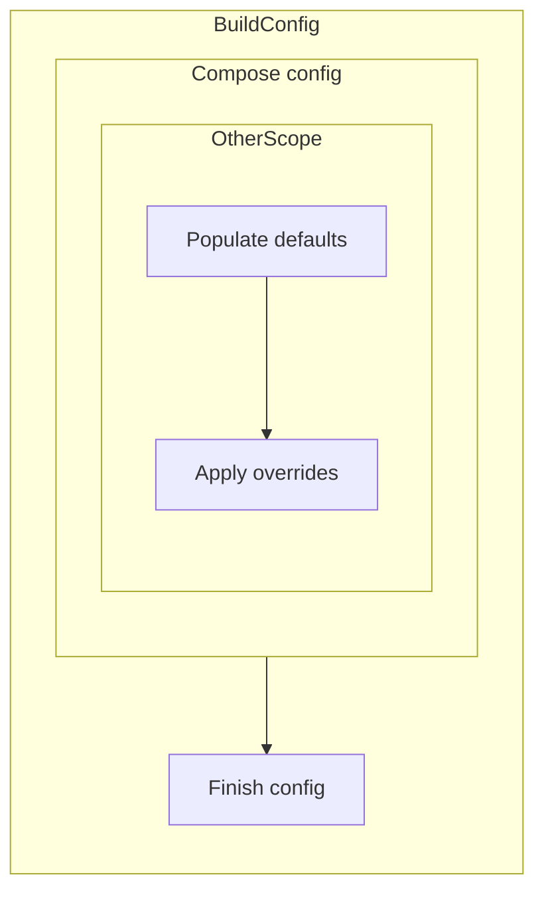

## Example 10
Combines a guard BranchGroup with early returns.
```baml pseudocode
function Resolve(flag: Bool) -> Result {
  //# Guard incoming flag
  if (!flag) {
    return Result::Error("flag missing");
  }
  //# Produce result
  let value = compute();
  return Result::Ok(value);
}
```

will result in this ControlFlowVisualization:
```control flow pseudocode
Nodes:
  - n0: parent=None, kind=FunctionRoot("Resolve")
    - n1: parent=n0, kind=HeaderContextEnter("Guard incoming flag")
      - n2: parent=n1, kind=BranchGroup("if (!flag)")
        - n3: parent=n2, kind=BranchArm("if (!flag)")
    - n5: parent=n0, kind=HeaderContextEnter("Produce result")

edges_by_src:
  n1: [n5]
```

and this mermaid:
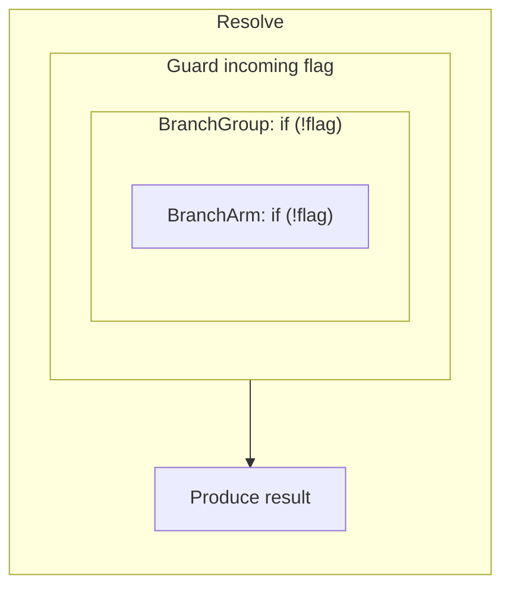

Early return is deliberately not modeled; same for `break` and `continue` - we have a plan for how to address this in a future version of visualization.

## Example 11
Demonstrates nested scopes (anonymous blocks, loops, and branches) sharing a single parent header context.
```baml
function BuildPipeline() -> Void {
  //# Setup context
  {
    initialize();
    //# In-scope configuration
    configure();
  }
  while (true) {
    //# wait for feature flags
    blockOnFeatureFlags();
  }
  {
    startDatabase();
    //# Boostrap schemas
    bootstrapSchemas();
  }
  if (false) {
    //# listen to SQS
    setupSqsPollers();
  }
  //# Done
  finish();
}
```

will result in this ControlFlowVisualization:
```control flow pseudocode
Nodes:
  - n0: parent=None, kind=FunctionRoot("BuildPipeline")
    - n1: parent=n0, kind=HeaderContextEnter("Setup context")
      - n2: parent=n1, kind=OtherScope
        - n3: parent=n2, kind=HeaderContextEnter("In-scope configuration")
      - n4: parent=n1, kind=Loop("while (true)")
        - n5: parent=n4, kind=HeaderContextEnter("wait for feature flags")
      - n6: parent=n1, kind=OtherScope
        - n7: parent=n6, kind=HeaderContextEnter("Boostrap schemas")
      - n8: parent=n1, kind=BranchGroup("if (false)")
        - n9: parent=n8, kind=BranchArm("if (false)")
          - n10: parent=n9, kind=HeaderContextEnter("listen to SQS")
    - n11: parent=n0, kind=HeaderContextEnter("Done")

edges_by_src:
  n1: [n11]
  n2: [n4]
  n4: [n6]
  n6: [n8]
```

and this mermaid:
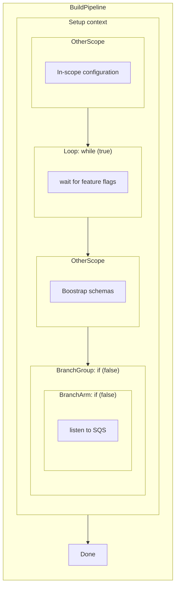


## Example 12
Captures an `if / else if / else` chain.
```baml pseudocode
function EvaluateStatus(level: Text) -> Void {
  //# Assess level
  CheckPreconditions();
  
  if (level == "urgent") {
    //# Handle urgent
    escalateToTierOne();
    //# Page escalation ladder
    escalateToManagers();
  } else if (level == "warning") {
    //# Handle warning
    warnTeam();
  } else {
    //# Handle normal
    proceed();
  }
  
  if (level.includes("phone")) {
    pageViaPhoneCalls();
  } else {
    //# page via app
    pageViaApp();
  }

  //# Finalize evaluation
  closeOut();
}
```

will result in this ControlFlowVisualization:
```control flow pseudocode
Nodes:
  - n0: parent=None, kind=FunctionRoot("EvaluateStatus")
    - n1: parent=n0, kind=HeaderContextEnter("Assess level")
      - n2: parent=n1, kind=BranchGroup("if (level == \"urgent\")")
        - n3: parent=n2, kind=BranchArm("if (level == \"urgent\")")
          - n4: parent=n3, kind=HeaderContextEnter("Handle urgent")
          - n5: parent=n3, kind=HeaderContextEnter("Page escalation ladder")
        - n6: parent=n2, kind=BranchArm("else if (level == \"warning\")")
          - n7: parent=n6, kind=HeaderContextEnter("Handle warning")
        - n8: parent=n2, kind=BranchArm("else")
          - n9: parent=n8, kind=HeaderContextEnter("Handle normal")
      - n10: parent=n1, kind=BranchGroup("if (level.includes(\"phone\"))")
        - n11: parent=n10, kind=BranchArm("if (level.includes(\"phone\"))")
        - n13: parent=n10, kind=BranchArm("else")
          - n14: parent=n13, kind=HeaderContextEnter("page via app")
    - n15: parent=n0, kind=HeaderContextEnter("Finalize evaluation")

edges_by_src:
  n1: [n15]
  n2: [n10]
  n4: [n5]
```

and this mermaid:
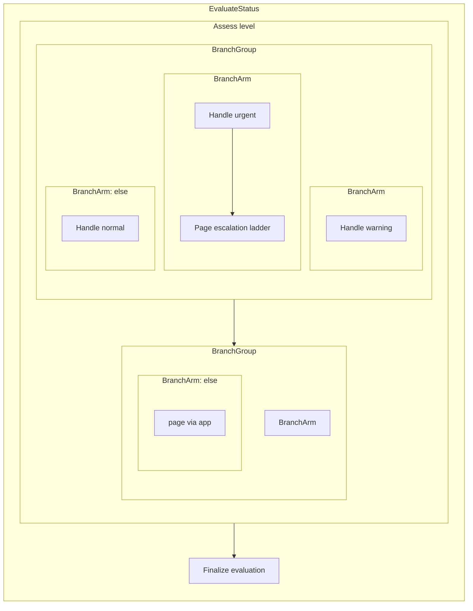

## Example 13
Demonstrates consecutive `//#`, `//##`, and `//###` headers with no intervening statements.
```baml pseudocode
function DraftDocument() -> Void {
  //# Build outline
  //## Opening section
  //### Key bullet list
  writeBullets();

  //# Final notes
  finalize();
}
```

will result in this ControlFlowVisualization:
```control flow pseudocode
Nodes:
  - n0: parent=None, kind=FunctionRoot("DraftDocument")
    - n1: parent=n0, kind=HeaderContextEnter("Build outline")
      - n2: parent=n1, kind=HeaderContextEnter("Opening section")
        - n3: parent=n2, kind=HeaderContextEnter("Key bullet list")
    - n4: parent=n0, kind=HeaderContextEnter("Final notes")

edges_by_src:
  n1: [n4]
```

and this mermaid:
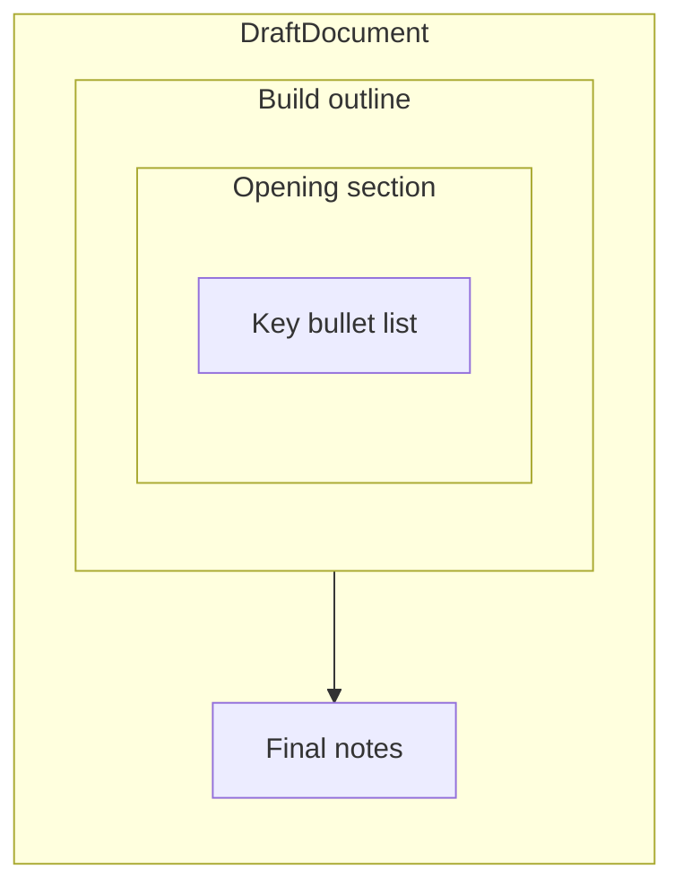
