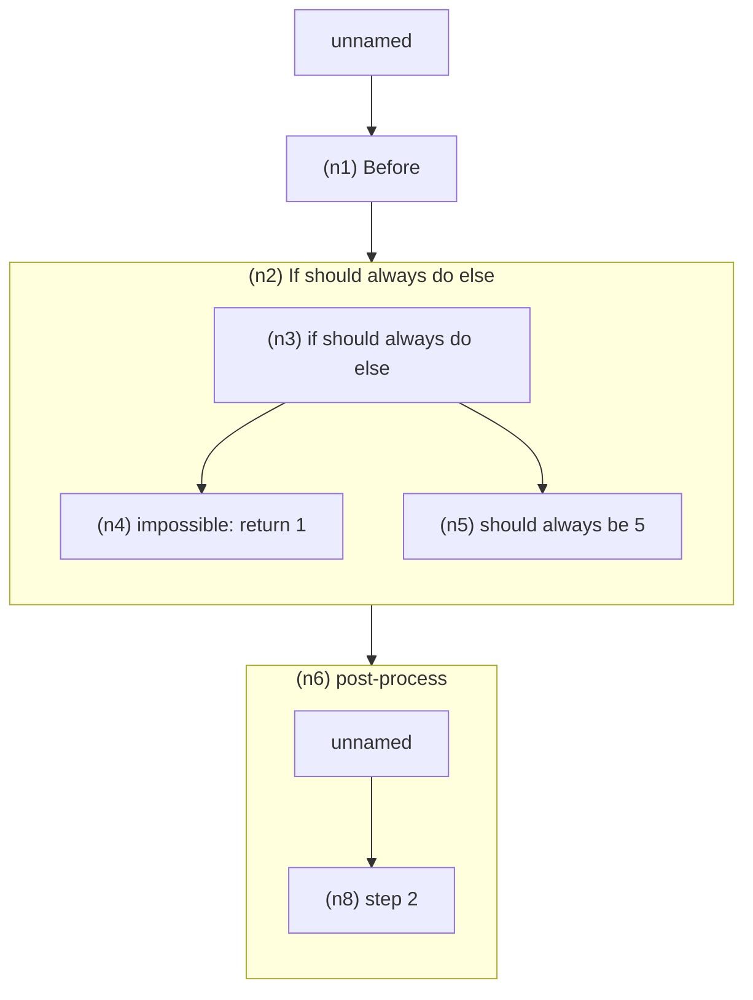

# User Requirements
I want to change how `//#` "VizPrefix" statements are handled in the BAML language.

- the compiler should be able to build a ControlFlowViz of a function using the `//#` VizPrefix statements in the function; the BAML playground will then convert ControlFlowViz into a ReactFlowControlFlowVisualization
- nesting in the ControlFlowViz is controlled by either:
	- `//#` `//##` `//###` hierarchy, or
	- starting a new scope
- at runtime, when control flow passes over a `//#` VizPrefix statement,  it will emit TraceContextNotification events which the playground can then use to highlight the currently executing node
- the playground will also show all `WatchNotification` events, and we want to be able to use the interleaved stream of `WatchNotification` and `TraceContextNotification` events to be able to associate `WatchNotification` events with a specific ReactFlowControlFlowVisualization node
- the viz should be useful even if it’s technically out of sync with the logs / source code
    - if I have `x = 1; x = 2; x = 2; x = 3;` in my log output, and I add another `x = 4` somewhere in my source code, I should still be able to see logs from the previous run

# Implementation Strategy
Ignoring how VizPrefix compiler/runtime logic is implemented today (this is the "markdown header" / AnnotatedStatement / mermaid logic) - there are bugs in the current system and it operates at the wrong level of abstraction (it should plug into the HIR, not the AST) - we should implement the following phases to achieve all the above described requirements.

# Strategies for Stable `NodeId`
To allow the visualization of my_baml_src@v2 to be useful for filtering a log stream of `WatchNotification` events emitted by a different version, say my_baml_src@v1, we should choose a format for `NodeId` that is reasonably stable under baml_src changes (e.g. adding a line of code in the middle of a function, or adding a new prefix comment).

Using a **path-based identifier** as our NodeId will allow us to achieve this, because so long as relative ordering within the same parent is unchanged, we can use the visualization of my_baml_src@v2 to build a filter that applies to and looks somewhat correct for my_baml_src@v1.

```rust
/// NodePathId encodes the ancestry path from function root to the control-flow node.
pub struct NodePathId {
    pub function: FunctionId,                     // owning function; ties the path to a compilation unit
    pub segments: SmallVec<[PathSegment; 8]>,     // ordered ancestry from root → leaf; typically small
}

/// Each segment describes how to reach the next scope or statement within the parent context.
pub enum PathSegment {
    Statement { ordinal: u32 },                   // nth statement within the current block (stable on inserts elsewhere)
    Header { slug: SmolStr, ordinal: u16 },       // normalized `//#` slug plus sibling count to disambiguate duplicates
    Scope { kind: ScopeKind, ordinal: u16 },      // transitions into nested scopes (if/else arms, loop bodies, etc.)
}

/// Enumerates lexical scope hops so IDs survive refactors that reorder statements of different kinds.
pub enum ScopeKind {
    FunctionRoot,
    Block,
    LoopBody,
    BranchArm,
}
```
# Example visualizations


```baml
function IfThenElse() -> int {
    let x = 1;

    //# Before
    PreProcess()

    //# If should always do else
    if (false) { 
        //## impossible: return 1
        1
    } else {
        //## should always be 5
        5
    }
    //# post-process
    PostProcess()

    //## step 2
    y
}
```

This should become a ControlFlowViz that can easily be converted to something like this




# Goal
We want to implement `BamlRuntime.function_graph_v2()` which will return a `ControlFlowViz`:

```rust
// NodeId needs a deterministic to-str and from-str conversion logic
impl FromStr for NodeId { ... }

pub struct Node {
  id: NodeId,
  // deliberately not named "parent" because "parent" is ambiguous w.r.t.
  // whether it precedes or encloses the current node
  parent_node_id: Option<NodeId>,
  label: String,
  span: Span,
  node_type: NodeType,
  // other attributes: e.g. may_return: bool (if we can return from the fn here)
}

pub enum NodeType {
  ExprBlock,
  Branch,
  Loop,
  Llm {
    client: String
  },
  ImpliedByNewScope,
  // when a new scope starts, and there's a statement without a prefix comment,
  // we should generate a new NodeType::ImpliedByStatement for it
  ImpliedByStatement,
}

pub struct Edge {
  src: NodeId,
  dst: NodeId,
  label: String,
}

pub struct ControlFlowVisualization {
  nodes: HashMap<NodeId, Node>,
  edges_by_src: HashMap<NodeId, Vec<Edge>>,
}
```

## HIR Traversal Algorithm for `function_graph_v2`
The graph builder runs after lowering into HIR so it can leverage `hir::Statement::Annotated` and normalized header slices. The traversal produces `ControlFlowViz` directly from a `hir::Function`, preserving the relative ordering of headers and statements while threading lexical scopes into `NodePathId` segments.

### Data Structures
Traversal state lives in a context object; it accumulates nodes/edges, tracks the current `NodePathId`, keeps a `flow_frontier` of predecessor nodes waiting to connect to the next emission, and records per-scope metadata for stable ordinals.

```rust
use smallvec::{smallvec, SmallVec};

struct HirTraversalContext {
    graph: ControlFlowVizBuilder,
    node_path: NodePathCursor,
    scope_stack: Vec<ScopeFrame>,
    flow_frontier: SmallVec<[NodeId; 4]>,
    fn_id: FunctionId,
}

impl HirTraversalContext {
    fn new(fn_id: FunctionId) -> Self { /* initialize builder, cursor, empty stack, empty frontier */ }
}
```

The frontier-based wiring means we don't retain explicit parent -> child edges; hierarchy is encoded via `NodePathId` and each `Node`'s `parent_node_id`, while `flow_frontier` only captures control-flow predecessors awaiting the next emission.

Scopes track statement ordinals and child-scope ordinals so ordinals stay stable while walking deeper scopes.

```rust
struct ScopeFrame {
    kind: ScopeKind,
    next_statement_ordinal: u32,
    next_child_scope: u16,
}

impl ScopeFrame {
    fn for_root() -> Self { /* kind = FunctionRoot */ }
    fn for_block(kind: ScopeKind) -> Self { /* zero ordinals */ }
    fn bump_child_scope(&mut self) -> u16 {
        let ord = self.next_child_scope;
        self.next_child_scope += 1;
        ord
    }
}
```

The cursor assembles stable `NodePathId` values using the `PathSegment` enum outlined above.

```rust
struct NodePathCursor {
    segments: SmallVec<[PathSegment; 8]>,
}

impl NodePathCursor {
    fn push_scope(&mut self, kind: ScopeKind, ordinal: u16) {
        self.segments.push(PathSegment::Scope { kind, ordinal });
    }

    fn push_statement(&mut self, ordinal: u32) -> NodePathId {
        self.segments.push(PathSegment::Statement { ordinal });
        NodePathId::from_segments(&self.segments)
    }

    fn push_header(&mut self, slug: &str, ordinal: u16) -> NodePathId {
        self.segments.push(PathSegment::Header {
            slug: SmolStr::new(slug),
            ordinal,
        });
        NodePathId::from_segments(&self.segments)
    }

    fn pop(&mut self) {
        self.segments.pop();
    }

    fn pop_scope(&mut self, kind: ScopeKind) {
        if matches!(self.segments.last(), Some(PathSegment::Scope { kind: k, .. }) if *k == kind) {
            self.segments.pop();
        }
    }

    fn current(&self) -> NodePathId {
        NodePathId::from_segments(&self.segments)
    }
}
```

The builder batches nodes and edges until we can fold edges by source.

```rust
struct ControlFlowVizBuilder {
    nodes: HashMap<NodeId, Node>,
    edges: Vec<Edge>,
}

impl ControlFlowVizBuilder {
    fn add_node(&mut self, node: Node) {
        self.nodes.insert(node.id.clone(), node);
    }

    fn add_edge(&mut self, src: NodeId, dst: NodeId, label: String) {
        self.edges.push(Edge { src, dst, label });
    }

    fn finish(self) -> ControlFlowVisualization {
        let mut edges_by_src: HashMap<NodeId, Vec<Edge>> = HashMap::new();
        for edge in self.edges {
            edges_by_src.entry(edge.src.clone()).or_default().push(edge);
        }
        ControlFlowVisualization { nodes: self.nodes, edges_by_src }
    }
}
```

### Entry Point
The traversal seeds the function root scope, emits the synthetic root node, and then walks the body block.

```rust
fn function_graph_v2(func: &hir::Function) -> ControlFlowVisualization {
    let mut ctx = HirTraversalContext::new(func.id());
    ctx.node_path.push_scope(ScopeKind::FunctionRoot, 0);

    let root_id = ctx.node_path.current();
    ctx.graph.add_node(Node::root(root_id.clone(), func.span));
    ctx.scope_stack.push(ScopeFrame::for_root());
    ctx.flow_frontier = smallvec![root_id.clone()];

    ctx.visit_block(&func.body);

    ctx.graph.finish()
}
```

### Block Traversal and Sequential Flow
Blocks increment ordinals for stable ordering, delegate to statements, handle optional tail expressions, and rely on the shared `flow_frontier` to surface whatever exits remain when unwinding the scope.

```rust
fn visit_block(&mut self, block: &hir::Block) {
    let is_root = self.scope_stack.last().map(|f| f.kind) == Some(ScopeKind::FunctionRoot);
    if !is_root {
        let ordinal = self.scope_stack.last_mut().unwrap().bump_child_scope();
        self.node_path.push_scope(ScopeKind::Block, ordinal);
    }

    self.scope_stack.push(ScopeFrame::for_block(ScopeKind::Block));

    for (idx, stmt) in block.statements.iter().enumerate() {
        self.scope_stack.last_mut().unwrap().next_statement_ordinal = idx as u32;
        self.visit_statement(stmt);
    }

    if let Some(tail) = &block.tail_expression {
        self.scope_stack.last_mut().unwrap().next_statement_ordinal = block.statements.len() as u32;
        self.visit_expression(tail);
    }

    self.scope_stack.pop();

    if !is_root {
        self.node_path.pop_scope(ScopeKind::Block);
    }
}
```

### Emitting Header and Statement Nodes
Annotated statements emit header nodes before visiting their payload; header-only annotations (where HIR stores `statement: None`) still wire correctly because the `flow_frontier` carries over to the next statement or expression until we emit a new node.

```rust
fn visit_statement(&mut self, stmt: &hir::Statement) {
    match stmt {
        hir::Statement::Annotated { headers, statement } => {
            if !headers.is_empty() {
                self.emit_header_nodes(headers);
            }
            if let Some(inner) = statement {
                self.visit_statement_inner(inner);
            }
        }
        other => self.visit_statement_inner(other),
    }
}
```

All node creation funnels through `emit_node`, which links the new node to every predecessor queued in `flow_frontier` and then resets the frontier to just the emitted node.

```rust
fn emit_node(&mut self, node: Node, edge_label: Option<String>) {
    let node_id = node.id.clone();
    let label = edge_label.unwrap_or_default();

    for pred in self.flow_frontier.iter().cloned() {
        self.graph.add_edge(pred, node_id.clone(), label.clone());
    }

    self.graph.add_node(node);
    self.flow_frontier.clear();
    self.flow_frontier.push(node_id);
}
```

Headers append a temporary `PathSegment::Header` to the cursor, emit a node, and then pop the segment.

```rust
fn emit_header_nodes(&mut self, headers: &[hir::Header]) {
    for (idx, header) in headers.iter().enumerate() {
        let node_id = self.node_path.push_header(&header.slug, idx as u16);
        let node = Node::from_header(node_id.clone(), header);
        self.emit_node(node, None);
        self.node_path.pop();
    }
}
```

Statements without richer control-flow structure still become nodes so logs can attach to them.

```rust
fn emit_implied_node(&mut self, span: Span, node_type: NodeType) {
    let ordinal = self.scope_stack.last().unwrap().next_statement_ordinal;
    let node_id = self.node_path.push_statement(ordinal);
    let node = Node::new(node_id.clone(), node_type, span);
    self.emit_node(node, None);
    self.node_path.pop();
}

fn visit_statement_inner(&mut self, stmt: &hir::Statement) {
    match stmt {
        hir::Statement::Let { span, .. }
        | hir::Statement::Assign { span, .. }
        | hir::Statement::AssignOp { span, .. }
        | hir::Statement::Declare { span, .. }
        | hir::Statement::DeclareAndAssign { span, .. }
        | hir::Statement::WatchOptions { span, .. }
        | hir::Statement::WatchNotify { span, .. }
        | hir::Statement::Semicolon { span, .. }
        | hir::Statement::Assert { span, .. }
        | hir::Statement::Break(span)
        | hir::Statement::Continue(span) => {
            self.emit_implied_node(*span, NodeType::ImpliedByStatement)
        }
        hir::Statement::Expression { expr, .. } => self.visit_expression(expr),
        hir::Statement::While { block, span, .. } => self.visit_loop(block, *span, LoopFlavor::While),
        hir::Statement::ForLoop { block, span, .. } => self.visit_loop(block, *span, LoopFlavor::For),
        hir::Statement::CForLoop { block, .. } => {
            let span = self.derive_block_span(block);
            self.visit_loop(block, span, LoopFlavor::CFor);
        }
        hir::Statement::Return { expr, span } => {
            self.visit_expression(expr);
            self.emit_terminal(*span, "return");
        }
    }
}
```

### Control-Flow Constructs
Expressions dispatch to specialized walkers for structured control flow; everything else collapses into `NodeType::ExprBlock` nodes.

```rust
fn visit_expression(&mut self, expr: &hir::Expression) {
    match expr {
        hir::Expression::If { if_branch, else_branch, span, .. } => {
            self.visit_if(if_branch, else_branch.as_deref(), *span)
        }
        hir::Expression::Block(block, _) => self.visit_block(block),
        hir::Expression::Call { span, .. }
        | hir::Expression::MethodCall { span, .. }
        | hir::Expression::ClassConstructor(_, span)
        | hir::Expression::BinaryOperation { span, .. }
        | hir::Expression::UnaryOperation { span, .. }
        | hir::Expression::Array(_, span)
        | hir::Expression::Map(_, span)
        | hir::Expression::ArrayAccess { span, .. }
        | hir::Expression::FieldAccess { span, .. }
        | hir::Expression::Paren(_, span)
        | hir::Expression::Identifier(_, span)
        | hir::Expression::StringValue(_, span)
        | hir::Expression::RawStringValue(_, span)
        | hir::Expression::NumericValue(_, span)
        | hir::Expression::BoolValue(_, span)
        | hir::Expression::JinjaExpressionValue(_, span) => {
            self.emit_implied_node(*span, NodeType::ExprBlock)
        }
    }
}
```

Branches allocate a statement ordinal for the branching point, emit a `NodeType::Branch`, and then visit each arm inside its own scope; the `flow_frontier` is reset to the branch node before each arm so control-flow edges originate there, and the resulting exit sets are merged without tracking explicit parent -> child edges.

```rust
fn visit_if(&mut self, then_expr: &hir::Expression, else_expr: Option<&hir::Expression>, span: Span) {
    let ordinal = self.scope_stack.last().unwrap().next_statement_ordinal;
    let branch_id = self.node_path.push_statement(ordinal);
    let branch_node = Node::branch(branch_id.clone(), span);
    self.emit_node(branch_node, None);
    self.node_path.pop();

    self.flow_frontier = smallvec![branch_id.clone()];
    let then_exit = self.walk_branch_arm(then_expr);

    let else_exit = else_expr.map(|expr| {
        self.flow_frontier = smallvec![branch_id.clone()];
        self.walk_branch_arm(expr)
    });

    self.flow_frontier = self.merge_branch_exits(branch_id, then_exit, else_exit);
}

fn walk_branch_arm(&mut self, expr: &hir::Expression) -> SmallVec<[NodeId; 4]> {
    let ordinal = self.scope_stack.last_mut().unwrap().bump_child_scope();
    self.node_path.push_scope(ScopeKind::BranchArm, ordinal);
    self.scope_stack.push(ScopeFrame::for_block(ScopeKind::BranchArm));

    match expr {
        hir::Expression::Block(block, _) => self.visit_block(block),
        _ => self.visit_expression(expr),
    }

    self.scope_stack.pop();
    self.node_path.pop_scope(ScopeKind::BranchArm);

    self.flow_frontier.clone()
}

fn merge_branch_exits(
    &self,
    branch_id: NodeId,
    then_exit: SmallVec<[NodeId; 4]>,
    else_exit: Option<SmallVec<[NodeId; 4]>>
) -> SmallVec<[NodeId; 4]> {
    let mut frontier = SmallVec::new();

    if !then_exit.is_empty() {
        frontier.extend(then_exit);
    }

    match else_exit {
        Some(exit) => frontier.extend(exit),
        None => frontier.push(branch_id),
    }

    frontier
}
```

Loop-like constructs reuse the same pattern but also emit explicit back-edges from the loop body to the loop header so playback and runtime highlighting know the iteration flow.

```rust
enum LoopFlavor {
    While,
    For,
    CFor,
}

impl LoopFlavor {
    fn label(&self) -> &'static str {
        match self {
            LoopFlavor::While => "while",
            LoopFlavor::For => "for",
            LoopFlavor::CFor => "cfor",
        }
    }
}

fn visit_loop(&mut self, body: &hir::Block, span: Span, flavor: LoopFlavor) {
    let ordinal = self.scope_stack.last().unwrap().next_statement_ordinal;
    let loop_node_id = self.node_path.push_statement(ordinal);
    let loop_node = Node::loop_node(loop_node_id.clone(), span);
    self.emit_node(loop_node, None);
    self.node_path.pop();

    self.flow_frontier = smallvec![loop_node_id.clone()];

    let scope_ord = self.scope_stack.last_mut().unwrap().bump_child_scope();
    self.node_path.push_scope(ScopeKind::LoopBody, scope_ord);
    self.scope_stack.push(ScopeFrame::for_block(ScopeKind::LoopBody));

    self.visit_block(body);

    let body_exits = self.flow_frontier.clone();
    for exit in body_exits.iter().cloned() {
        self.graph
            .add_edge(exit, loop_node_id.clone(), format!("{}:repeat", flavor.label()));
    }

    self.scope_stack.pop();
    self.node_path.pop_scope(ScopeKind::LoopBody);

    self.flow_frontier = smallvec![loop_node_id];
}

// helper extracts a representative span when explicit loop spans are missing
fn derive_block_span(&self, block: &hir::Block) -> Span {
    block
        .statements
        .iter()
        .filter_map(statement_primary_span)
        .next()
        .or_else(|| block.trailing_expr.as_ref().and_then(expression_primary_span))
        .unwrap_or_else(Span::dummy)
}

fn statement_primary_span(stmt: &hir::Statement) -> Option<Span> { /* match variants to pluck existing spans */ }
fn expression_primary_span(expr: &hir::Expression) -> Option<Span> { /* mirror visit_expression matching */ }
```

Early terminators (`return`, `break`, `continue`, `throw`, etc.) emit their own nodes, connect to synthetic exit nodes as needed, and then clear the `flow_frontier` so fallthrough edges are suppressed.

```rust
fn emit_terminal(&mut self, span: Span, label: &str) {
    let ordinal = self.scope_stack.last().unwrap().next_statement_ordinal;
    let node_id = self.node_path.push_statement(ordinal);
    let node = Node::terminal(node_id.clone(), span, label);
    self.emit_node(node, None);
    self.node_path.pop();

    self.flow_frontier.clear();
}
```

### Finalization and Post-Processing
Once traversal finishes, the builder folds edges by source, synthesizes `ImpliedByNewScope` nodes for empty scopes (where no body statements were encountered), and runs validation that every `NodeId` in the graph can round-trip through `NodePathId` → `NodeId` conversions. The resulting `ControlFlowVisualization` is ready for serialization and runtime lookups by `NodePathId`.
